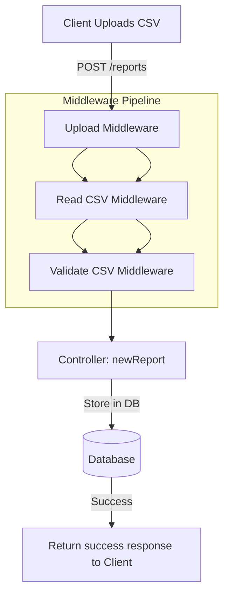
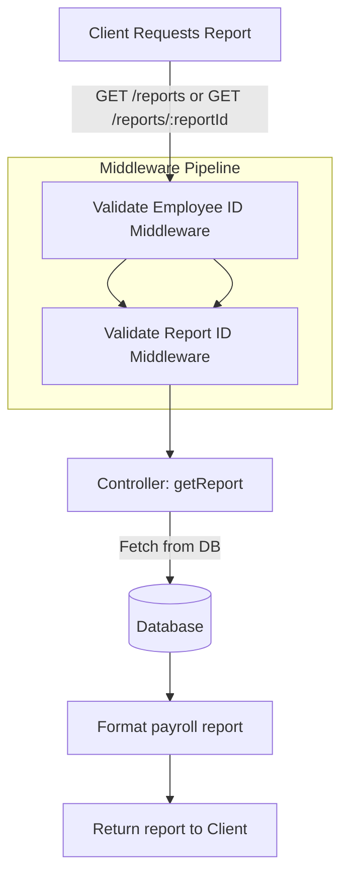

# Payroll Challenge

## Instructions on how to build/run your application
Using a Docker container:
```sh
$ docker build -t will-pringle-se-challenge-payroll .
$ docker run -p 3300:3300 --name payroll-app will-pringle-se-challenge-payroll
# verify it's working by making a request to /status
$ curl localhost:3300/status
```

Running natively:
```sh
$ npm i
$ node app.js # note, this has only been tested on Node 20
# verify it's working by making a request to /status
$ curl localhost:3300/status
```
An [OpenAPI spec](./docs/spec.yaml) is available for reference (_also served on the `/docs` endpoint when the server is running, see screenshot below_).


Once it's running, here are some example requests to upload and view data assuming the `PORT` environment variable is set to `3300`:
```bash
# === Upload a time report ===
curl -F 'file=@tests/resources/time-report-42.csv' 'localhost:3300/reports'
# Responds with:
#
# {
#   "success": true,
#   "data": {
#     "id": 42
#   }
# }
```

```bash
# === View Reports ===
curl localhost:3300/reports/42
# Responds with:
#
# {
#   "success": true,
#   "data": {
#     "payrollReport": {
#       "employeeReports": [
#         {
#           "employeeId": "1",
#           "payPeriod": {
#             "startDate": "2023-11-01",
#             "endDate": "2023-11-15"
#           },
#           "amountPaid": "$150.00"
#         },
#         ... (a bunch more)
#       ]
#     }
#   }
# }

```

Tests are run in CI using [GitHub actions](https://github.com/wiwichips/payroll-challenge/actions)

## Questions

### How did you test that your implementation was correct?

- I verified through end to end testing that the data generated by the reports matched calculations I performed by hand. 
- I created a [checklist of requirements](link) from the assignment description and verified I completed each item

### If this application was destined for a production environment, what would you add or change?

Monitoring and Health Checks
- A more detailed health check endpoint would help monitor key metrics like database connection status and request response times
- Integrate with monitoring tools like Grafana or Prometheus to track performance and service health
- Improve error handling with detailed logs and alerts to make debugging and support easier in production.
- This will help identify issues sooner, improve the ability to introspect the services more easily during incidents and find areas for improvement such as slow response times

Authentication and Authorization:
- Implement secure authentication (e.g., JWT or OAuth) to restrict access
- Add role-based authorization to ensure only privileged users can modify sensitive data like job group pay rates. *For example you wouldn't want one of your employees to modify what job group they're in but you may want them to see what job group they're in*

Requirements
- I would discuss the requirements with stakeholders. Although the assignment description is pretty explicit, there's always a difference of assumptions between human beings discussing a requirements for a nontrivial project
- For example, expanding the requirements to include a `/reports/:reportId` endpoint and enabling an employee id to be specified in a query param may not align with actual needs of the client using it

Database
- Switch to a more scalable database, such as PostgreSQL, to handle multiple concurrent writes, reads, and horizontal scaling

ORM Integration
- Use an ORM (*e.g., Prisma with PostgresSQL*) to improve abstraction, support migrations, and enhance maintainability
- This would also reduce SQL injection risks and facilitate future database changes

Other
- Rate limiting (for performance and to avoid attacks)
- `/reports` pagination (so the client can consume the data at a comfortable pace for themselves and the server - don't want the page loading the data to get really laggy)
- Continuous Deployment (reducing the time it takes for a code change to land in production makes teams perform better)
- Caching responses to popular requests (While I was an intern at Wave I implemented caching for GraphQL queries which reduced the size of data transmitted to the server by a large amount for some complicated requests. This payroll server could benefit from a caching optimization as well so it doesn't have to hit the database quite as frequently)

### What compromises did you have to make as a result of the time constraints of this challenge?

- I wanted to have more thorough testing, many of the error cases are untested such as exceeding the maximum file size and other cases like that. 
- Database and SQL logic are tightly coupled with controllers and middleware. Ideally, they should be separated to increase modularity and reusability. See my point above about ORMs and Sqlite3 as well. 

## Models / Entities

### Database Models
The database comprises of 4 tables: `job_groups`, `employees`, `time_reports`, `work_entries`. These tables are listed generically and can be used with different relational database solutions, for more details on the specific database table types used with sqlite, check out [database/init.js](./database/init.js).

#### job_groups
| Field | Type | Key | Units|
| - | - | - | - |
| name | string | primary |
| hourly_rate | integer | | cents |

Assumptions:
- The currency is either entirely in CAD or entirely in USD; however if in the future this is no longer the case, an additional column could be added to the job_groups table for the currency applied to a particular job group.
- Hour rates will always be cleanly divisible into cents. For instance, $3.141 per hour is invalid, but $3.14 per hour is valid.
- Job groups will change and there may be more in the future.
- No one will be paid more than $9999 per hour. 

Design Notes:
- Hourly Rate is stored in cents to avoid floating point inconsistencies and save space.

#### employees
| Field | Type | Key | Units |
| - | - | - | - |
| id | string | primary |

Design Notes:
- Currently the employees table doesn't serve much purpose; however, maybe in the future more information will need to be tracked for specific employees
- Although the examples use integers for the employee id, in the assignment it's stated the employee id is a string

#### time_reports
| Field | Type | Key | Units |
| - | - | - | - |
| id | integer | primary |
| upload_date | date |

Assumptions:
- This is required for archival purposes

#### work_entries
| Field | Type | Key | Units |
| - | - | - | - |
| id | integer | primary |
| date | date |
| time_duration | integer | | seconds |
| job_group | string | foreign key |
| report_id | integer | foreign key |
| employee_id | string | foreign key |

Assumptions:
- Hours Worked will always be cleanly divisible into seconds

## Separation of Concerns

I take advantage of middleware in express to divide most of the core logic and error checking into separte areas.

Database initialization is in a separate script not coupled with the main server, and can be executed as a CLI program or required (like the test setup does).

Config logic is stored in one central file which is required by other files, the core logic for envrionemnt variables reamins within the file.

### Middleware Pipeline Diagram

#### Uploading a CSV (making a POST request to `/reports`)


- A. Client makes a POST request to the server with multipart-data/form-data containing a valid csv file 
- B. The [Upload Middlware](https://www.npmjs.com/package/multer) parses the data providing `req.files`.
- C. Read CSV Middleware reads any generic CSV data and populates `req.locals` with `data` and `headers`.
- D. Validate CSV Middleware looks at the content of the CSV and ensures it matches the spec.
- E. The New Report controller populates the database with the report data.
- F. Server responds to client with the ID of the report just uploaded on success

Each section of the pipeline deals with responding to errors relevant to its work. For example, Read CSV will only respond with errors related to CSV parsing but Validate CSV will respond with errors related to payroll report data.

#### Downloading a CSV (making a GET request to `/reports` or `/reports/:id)


- A. Client makes a GET request to either `/reports` (for all reports) or `/reports/:reportId` (for a specific report).
- B. The Validate EmployeeId Middleware checks if the employeeId passed as a query param exists. If it's invalid, the request is rejected.
- C. The Validate ReportId Middleware checks if the reportId passed as a path param exists. If it's invalid, the request is rejected
- D. The Get Report Controller handles the core logic of fetching and transforming the report data from the database.
- E. The controller fetches data from the database using the necessary parameters.
- F. The controller transforms the raw data into the required payroll report format (as specified by the assignment).
- G. Server respoinds to the client with the transformed payroll report data

## Other
The original instructions are [here (docs/wave-instructions.md)](./docs/wave-instructions.md).


